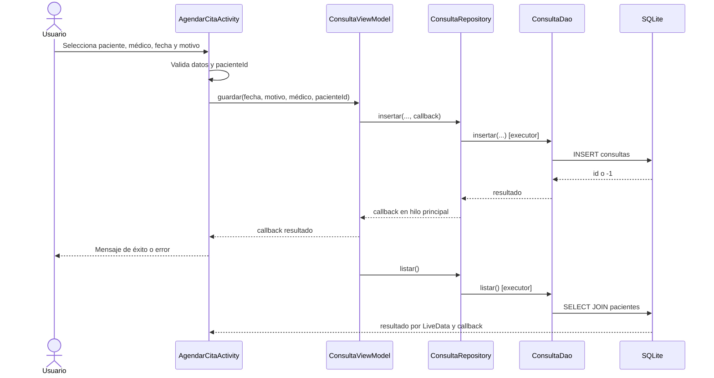

# Diagrama UML de secuencia — Agendar cita

```mermaid
sequenceDiagram
    actor Usuario
    participant UI as AgendarCitaActivity
    participant VM as ConsultaViewModel
    participant R as ConsultaRepository
    participant DAO as ConsultaDao
    participant DB as SQLite
    Usuario->>UI: Selecciona paciente, médico, fecha y motivo
    UI->>UI: Valida datos y pacienteId
    UI->>VM: guardar(fecha, motivo, médico, pacienteId)
    VM->>R: insertar(..., callback)
    R->>DAO: insertar(...) [executor]
    DAO->>DB: INSERT consultas
    DB-->>DAO: id o -1
    DAO-->>R: resultado
    R-->>VM: callback en hilo principal
    VM-->>UI: callback resultado
    UI-->>Usuario: Mensaje de éxito o error
    VM->>R: listar()
    R->>DAO: listar() [executor]
    DAO->>DB: SELECT JOIN pacientes
    DB-->>UI: resultado por LiveData y callback
```
